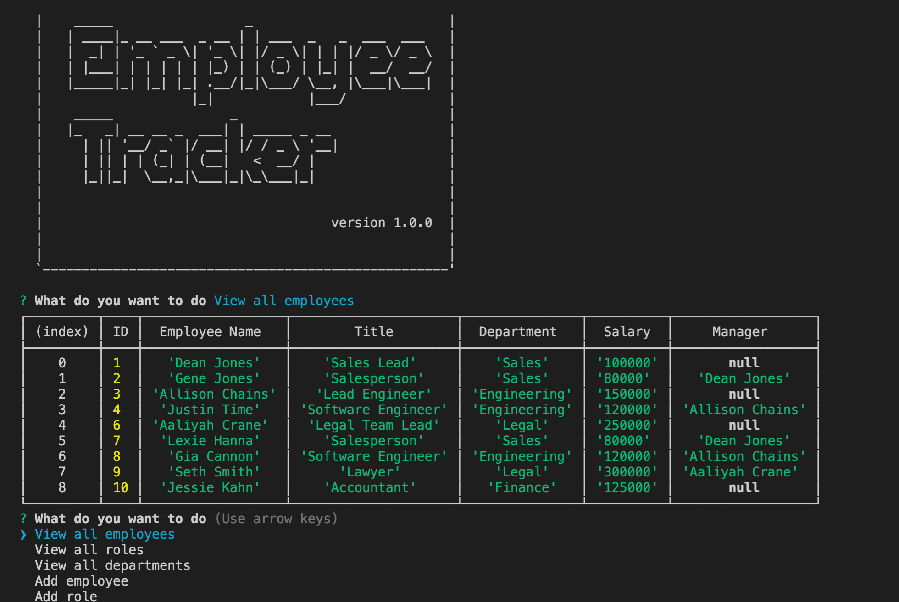

# on-track-employee-tracker
## by Aaron Rosenblatt

#### I wrote code using Node.js, Inquirer and MySQL to build a command-line application to manage a company's database of employees. The Content Management System interface is divided into three groups: departments, roles and employees. Upon starting the application, the user is taken to a menu with options to view all departments, view all roles, view all employees, add an employee, role or department, delete an employee, role or department, update an employee role or manager, view all employees by department or manager, view the sum of all employee's salaries or exit the menu.

#### When the user chooses to view all departments, formatted tables shows the department names and id's. MySQL allows the user to see all the information as tables and foreign keys are used to join the three tables. When the user chooses to view all roles, a table presents the job title, role id, department that role belongs to and the salary for that role. Viewing all employees allows the user to see a table showing employee id's, first names, last names, job titles, departments, salaries and the employee's manager. 

#### When the user opts to add a department, the name of that department is added to the database. Adding a role allows the user to enter the role name, salary and department. If the user chooses to add an employee a prompt asks the employee to enter the first name, last name, role and the new employee's manager. If the new employee does not have a manager there is an option to select no manager. Finally, the user can update an employee role and prompts allow the user to select an employee from a list, update their new role and their new manager (if there is a manager).

#### To use On Track Employee Tracker, clone the [app](https://github.com/noplur/on-track-employee-tracker), use Terminal to go to the On Track Employee Tracker's root directory and enter "node start.js" and follow the prompts. 

### The On Track Employee Tracker walk-through video can be viewed here: https://drive.google.com/file/d/1KIJ-gY6lUBIn8J8giMr6pCmfG7s0ckrt/view

### The GitHub repository for the On Track Employee Tracker can be viewed here: https://github.com/noplur/on-track-employee-tracker

### Here is a screenshot of a sample from On Track Employee Tracker:
### 